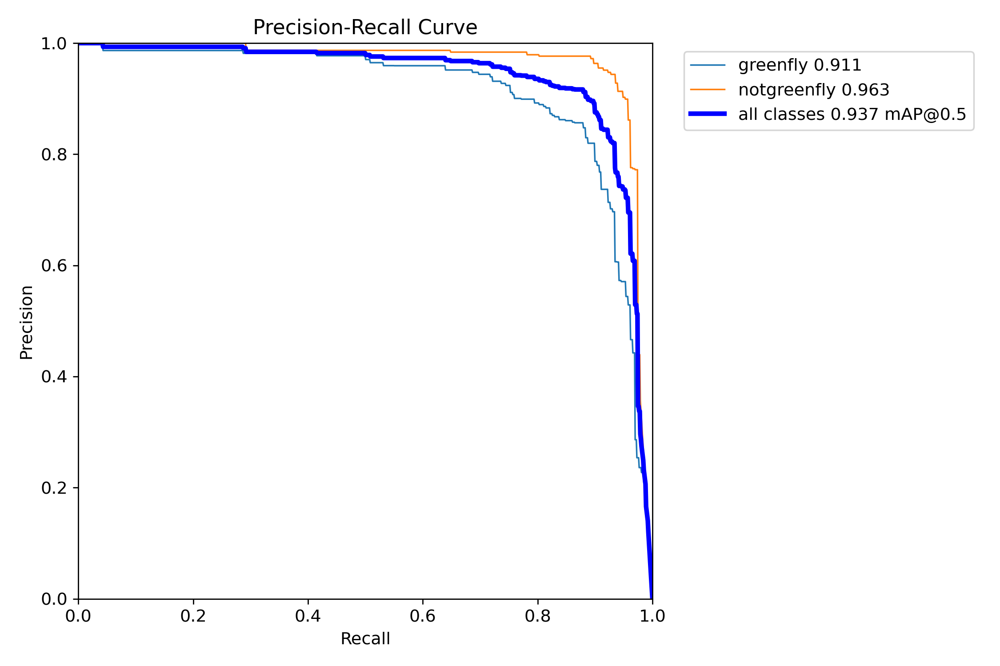
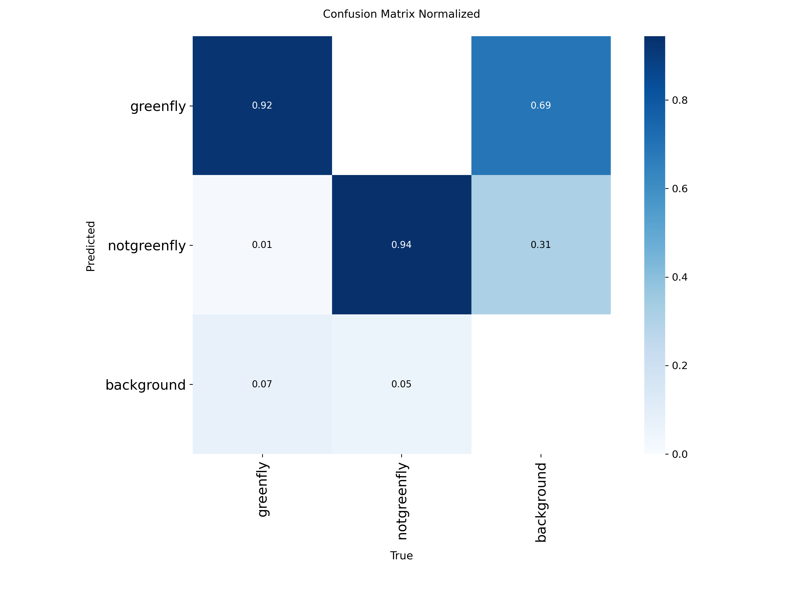
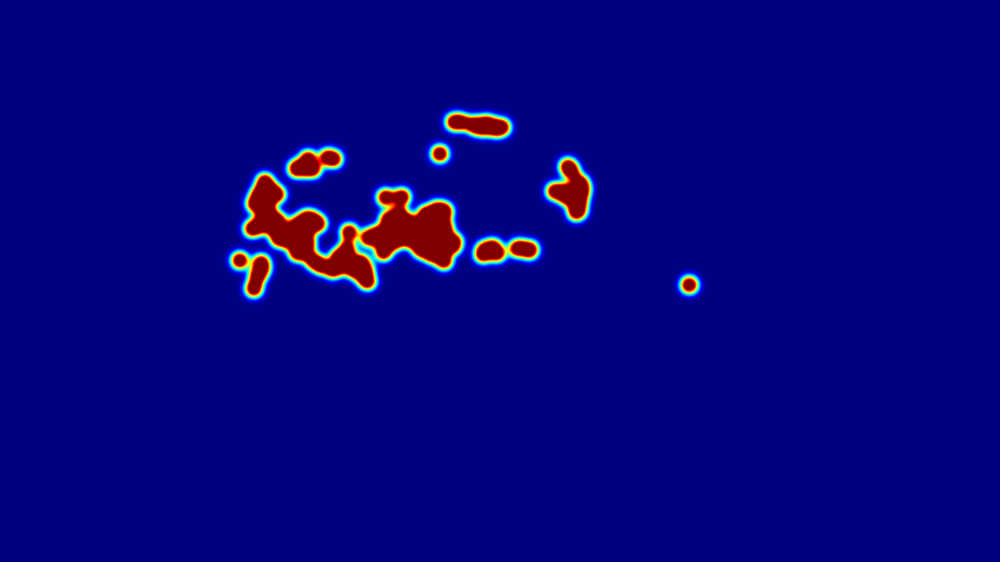

# 🪰 Greenfly Detection and Multi-Object Tracking Pipeline

[](https://www.kaggle.com/code/archariox/cse445-assignment1-f)
[](https://www.kaggle.com/code/istwestkhan/cse445-assignment1-f-rf-detr)

## Project Overview
This repository contains a complete computer vision pipeline designed to detect and track greenflies in both static images and drone video footage. The project tackles the challenge of identifying small, clustered insects against complex organic backgrounds. 

The pipeline utilizes a custom-trained **YOLOv8** model for highly accurate object detection and evaluates four distinct tracking algorithms (**SimpleIoU, Custom SORT, ByteTrack, and BoTSORT**) to determine the most robust solution for maintaining ID continuity across frames. Additionally, an advanced **RF-DETR** (Transformer-based) model was trained as a comparative architecture.

---

## 📊 Part 1: YOLOv8 Training & Performance Analysis
The model was trained on an augmented dataset comprising 3,256 `greenfly` and 3,543 `notgreenfly` instances. Training was conducted over 42 epochs[cite: 1], yielding excellent generalization and high precision.

### 1. Training Convergence & Metrics
![Results Graph]runs/detect/greenfly_yolo26_train_optimized/results.png) 
* **Convergence:** The model converged smoothly over 42 epochs, with a final `train/box_loss` of 0.941 and `train/cls_loss` of 0.312[cite: 1]. 
* **Augmentation Strategy:** A sharp drop in training loss is visible at Epoch 41[cite: 1]. This indicates the successful disabling of mosaic augmentation during the final epochs, allowing the model to fine-tune on true spatial distributions.
* **Overall mAP:** The model achieved a highly impressive **mAP@0.5 of 0.937** across all classes[cite: 1].

### 2. Precision-Recall Curve


The PR Curve demonstrates the model's reliability:
* **Greenfly:** 0.911 mAP@0.5
* **Not Greenfly:** 0.963 mAP@0.5
* The area under the curve confirms that the model maintains high precision even as recall increases, meaning it successfully identifies almost all flies without accidentally drawing boxes around random background elements.

### 3. Confusion Matrix Analysis


The normalized confusion matrix highlights the classification accuracy:
* **True Positives:** The model achieves a **92% accuracy** for greenflies and **94% accuracy** for non-greenflies.
* **False Positives (Background Confusion):** Only 7% of background elements were incorrectly classified as greenflies. Because insects cluster together on natural textures (leaves, dirt), the model occasionally flags organic background shadows as insects, which is an expected margin of error for small-object detection.

### 4. Bounding Box Density Heatmap


* **Spatial Distribution:** The `x` and `y` density heatmaps reveal a strong central clustering. This indicates that the subject flies are predominantly located near the center of the captured frames.
* **Aspect Ratio:** The bounding boxes are heavily skewed toward small, uniform squares, which accurately reflects the physical shape of the target insects.

---

## 🎯 Part 2: Tracker Implementation & Comparison
Detecting the flies is only half the challenge; maintaining unique IDs across frames (when flies overlap or move erratically) requires robust tracking logic. Four trackers were implemented and evaluated.


### Visual Tracking Results
*(Click on any video to watch the tracking in action)*

| SimpleIoU Baseline | ByteTrack (Advanced) |
| :---: | :---: |
| [](https://youtu.be/rxhE6NRB6gA) | [](https://youtu.be/NhJX9miisLs) |
| *Fast baseline, but drops IDs during heavy overlap.* | *Highly resilient to temporary occlusion. (Recommended)* |

| Custom SORT | BoTSORT |
| :---: | :---: |
| [](https://youtu.be/A4ZOOHumD-Y) | [](https://youtu.be/J6r63uEs5D4) |
| *Utilizes Kalman Filters for linear motion prediction.* | *Integrates camera motion compensation for dynamic drone footage.* |

### Quantitative Analysis
The JSON metrics located in the `output/` directory confirm the performance trade-offs:
1. **SimpleIoU / Custom SORT:** These baseline trackers occasionally suffer from the "Cluster Problem." When YOLO momentarily merges tightly overlapping flies into a single bounding box, these trackers break the ID and assign a new one in the next frame.
2. **ByteTrack / BoTSORT:** These advanced trackers perform significantly better. By lowering the confidence threshold for unmatched tracks (ByteTrack) and accounting for camera shake (BoTSORT), they successfully maintain ID continuity even when flies crawl over one another.

### Spatial Tracking Density
To visualize where the trackers spent the most time processing IDs, density heatmaps were generated for each algorithm:
* 

---

## 🤖 Part 3: RF-DETR (Transformer) Implementation
As a bonus objective, the dataset was converted into COCO format to train an **RF-DETR** (Transformer-based) object detection model. Transformers remove the need for Non-Maximum Suppression (NMS) and excel at global context, making them theoretically ideal for dense object clustering. 

The full training loop, metric generation, and evaluation for the RF-DETR architecture can be found in this dedicated Kaggle Notebook:
👉 [**RF-DETR Training & Tracking Notebook**](https://www.kaggle.com/code/istwestkhan/cse445-assignment1-f-rf-detr)

---

## 💻 How to Run Locally

1. Clone this repository:
   ```bash
   git clone [https://github.com/YOUR_GITHUB_USERNAME/cse445-yolo-tracking.git](https://github.com/YOUR_GITHUB_USERNAME/cse445-yolo-tracking.git)
   cd cse445-yolo-tracking
