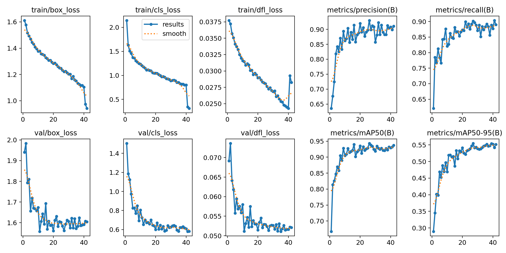
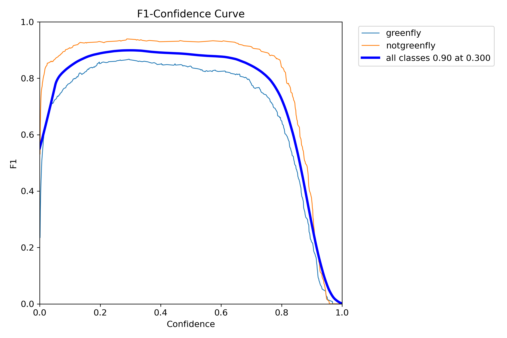
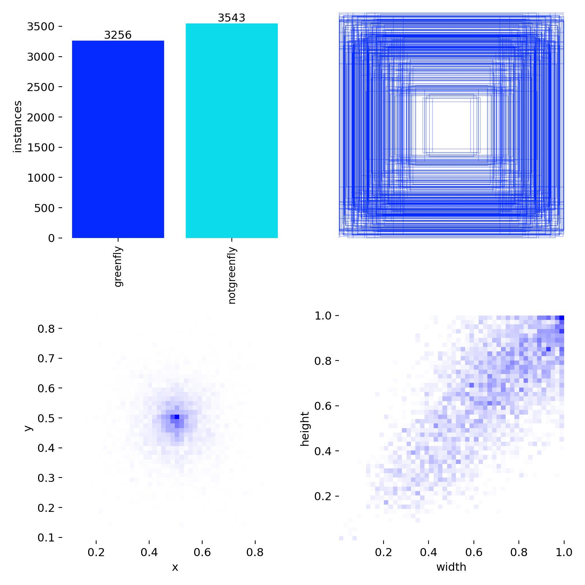
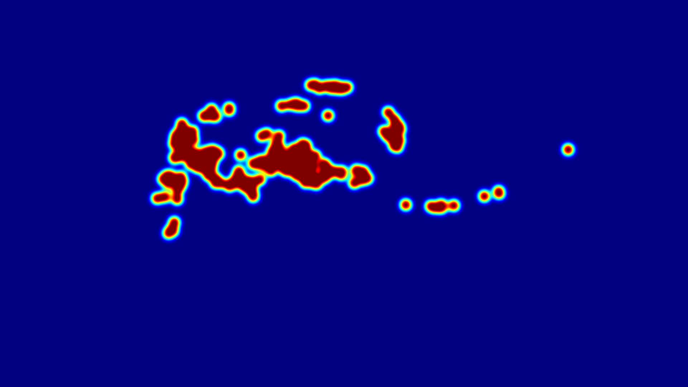
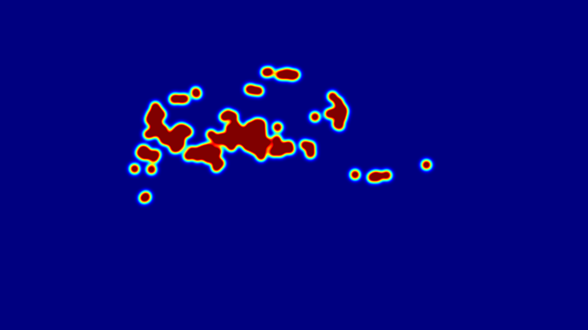
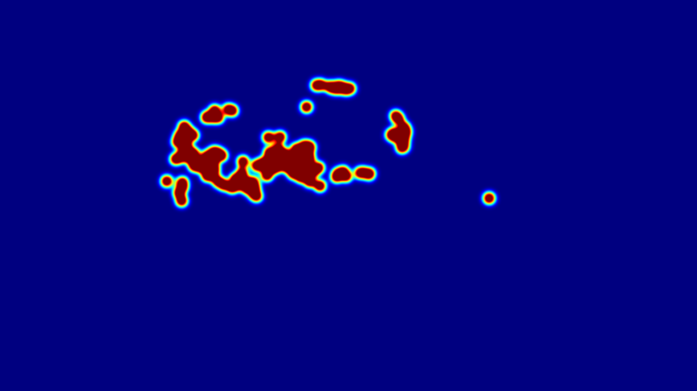

# 🪰 Greenfly Detection and Multi-Object Tracking Pipeline (YOLOv26)

[](https://www.kaggle.com/code/archariox/cse445-assignment1-f)
[](https://www.kaggle.com/code/istwestkhan/cse445-assignment1-f-rf-detr)

## 📌 Project Overview
This repository contains a complete computer vision pipeline designed to detect and track greenflies in both static images and drone video footage. The project tackles the challenge of identifying small, clustered insects against complex organic backgrounds. 

The pipeline utilizes a custom-trained **YOLOv26** model for high-precision object detection and evaluates four distinct tracking algorithms (**SimpleIoU, Custom SORT, ByteTrack, and BoTSORT**) to determine the most robust solution for maintaining ID continuity across frames. Additionally, an advanced **RF-DETR** (Transformer-based) model was trained as a comparative architecture.

---

## 📊 Part 1: YOLOv26 Training & Performance Analysis
The model was trained on an augmented dataset comprising 3,256 `greenfly` and 3,543 `notgreenfly` instances. Training was conducted over 42 epochs, yielding excellent generalization and high precision.

### 1. Training Convergence & Metrics
 

* **Convergence:** The model converged smoothly over 42 epochs, reaching a final `train/box_loss` of 0.941 and `train/cls_loss` of 0.312. 
* **Augmentation Strategy:** A sharp drop in training loss is visible at Epoch 41. This indicates the successful disabling of mosaic augmentation during the final stages, allowing the model to fine-tune on true spatial distributions.
* **Overall Accuracy:** The model achieved a highly impressive **mAP@0.5 of 0.937** across all classes.

### 2. Precision-Recall & F1 Confidence
| Precision-Recall (mAP) | F1-Confidence Curve |
| :---: | :---: |
|  |  |

* **Greenfly:** 0.911 mAP@0.5
* **Not Greenfly:** 0.963 mAP@0.5
* The curves demonstrate that the model maintains high precision even as recall increases, effectively identifying small insects without flagging background noise.

### 3. Confusion Matrix Analysis


* **True Positives:** The model achieves **92% accuracy** for greenflies and **94% accuracy** for non-greenflies.
* **Background Confusion:** Only 7% of background elements were incorrectly classified as greenflies. Given the organic texture of the environment (leaves/dirt), this is a highly optimized result for small-object detection.

### 4. Bounding Box Density Heatmap


* **Spatial Distribution:** The `x` and `y` density heatmaps reveal a strong central clustering, indicating the model is optimized for center-of-frame tracking typical of drone footage.
* **Size Profile:** The width/height heatmaps confirm a high density of small, uniform bounding boxes, perfectly matching the insect profiles.

---

## 🎯 Part 2: Tracker Implementation & Comparison
Detecting the flies is only half the challenge; maintaining unique IDs during overlaps and erratic movements requires robust tracking logic.

### 🎥 Visual Tracking Results
*(Click on any thumbnail to watch the full HD tracking demo on YouTube)*

| SimpleIoU Baseline | ByteTrack (Advanced) |
| :---: | :---: |
| [](https://youtu.be/rxhE6NRB6gA) | [](https://youtu.be/NhJX9miisLs) |
| *Fast baseline; struggles with occlusion.* | *Highly resilient; maintains ID continuity.* |

| Custom SORT | BoTSORT |
| :---: | :---: |
| [](https://youtu.be/A4ZOOHumD-Y) | [](https://youtu.be/J6r63uEs5D4) |
| *Uses Kalman Filters for motion prediction.* | *Integrates camera motion compensation.* |

### 📊 Quantitative Performance Comparison

| Tracker | Avg FPS | Total IDs | ID Switches (Est.) | Performance Tier |
| :--- | :--- | :--- | :--- | :--- |
| **SimpleIoU** | 30.60 | 38 | 17 | Baseline (High Fragmentation) |
| **Custom SORT** | 30.95 | 36 | 16 | Kalman-stabilized Baseline |
| **ByteTrack** | **32.73** | 13 | 6 | **High Performance / Optimal** |
| **BoTSORT** | 20.31 | **12** | **6** | Maximum Stability / Slow |

**Technical Analysis:**
* **Efficiency:** **ByteTrack** is the overall winner, providing the highest processing speed (**32.73 FPS**) while reducing ID switches by over 60% compared to SORT.
* **Stability:** **BoTSORT** achieved the lowest unique ID count (12), but its higher computational cost makes it less ideal for real-time drone deployment compared to ByteTrack.

### 🗺️ Spatial Tracking Density Analysis
These heatmaps highlight where each tracker maintained the most consistent ID presence throughout the drone footage.

| SimpleIoU Heatmap | ByteTrack Heatmap |
| :---: | :---: |
|  |  |

| Custom SORT Heatmap | BoTSORT Heatmap |
| :---: | :---: |
|  |  |

---

## 🤖 Part 3: RF-DETR (Transformer) Implementation
As a bonus objective, the dataset was converted into COCO format to train an **RF-DETR** (Transformer-based) model. This architecture removes the need for Non-Maximum Suppression (NMS) and excels at global context, making it theoretically ideal for dense object clustering.

The full training loop and evaluation details can be found in this dedicated Kaggle Notebook:
👉 [**RF-DETR Training & Tracking Notebook**](https://www.kaggle.com/code/istwestkhan/cse445-assignment1-f-rf-detr)

---

## 💻 How to Run Locally

1. Clone this repository:
   ```bash
   git clone [https://github.com/tanvir-dev2000/cse445-yolo-tracking.git](https://github.com/tanvir-dev2000/cse445-yolo-tracking.git)
   cd cse445-yolo-tracking
